# 我们编程吧 之 Linux 学习手册

**Version 0.42**

[TOC]

## diff 比较两个目录的不同

diff命令会按行比较文件。但是它也可以比较两个目录：

1. ls -l /tmp/r
2. ls -l /tmp/s
3. 使用 diff 比较两个文件夹
4. diff /tmp/r/ /tmp/s/

## Linux 终端的使用汇总（包括命令方式打开终端）


一、打开终端的方式

1.鼠标点右键–terminal,即可打开。

2.点任务栏的"application"里面的"terminal"打开

3.命令方式：Alt＋F2后在出现"运行应用程序"中输入x-terminal-emulator(一般在你输入到x-term后系统会自己显示全部)或者输入"gnome-terminal"

二、使用终端的快捷方式

- Shift+Ctrl+T:新建标签页
- Shift+Ctrl+W:关闭标签页
- Ctrl+PageUp:前一标签页
- Ctrl+PageDown:后一标签页
- Shift+Ctrl+PageUp:标签页左移
- Shift+Ctrl+PageDown:标签页右移
- Alt+1:切换到标签页1
- Alt+2:切换到标签页2
- Alt+3:切换到标签页3
- Shift+Ctrl+N:新建窗口
- Shift+Ctrl+Q:关闭终端

终端中的复制／粘贴:

- Shift+Ctrl+C:复制
- Shift+Ctrl+V:粘贴

终端改变大小：

- F11：全屏
- Ctrl+plus:放大
- Ctrl+minus:减小
- Ctrl+0:原始大小

打开多个终端时，要从一个终端转到另外一个终端，可以通过同时按下alt后，再按tab键，按到自己想要的终端后松开，即可跳到想要得终端

## 锁定Linux文件夹

为了我的数据隐私，我想要锁定我文件服务器下的/downloads文件夹。因此我运行了：

```
chmod 0000 /downloads
```

root用户仍旧可以访问，而ls和cd命令则不工作。要还原它用：

```
chmod 0755 /downloads
```

## Linux下高效地复制粘贴

大凡现在的Linux系统，选择即复制，中键单击即可粘贴。

## tee可以看见输出并将其写入到一个文件中

可以看见输出并将其写入到一个文件中

如下使用tee命令在屏幕上看见输出并同样写入到日志文件my.log中

```
ls | tee my.log
```

tee可以保证你同时在屏幕上看到ls的输出并写入文件 my.log。

tee 的解释为：_read from standard input and write to standard output and files_

## 如何用cp拷贝指定序号的文件

现在有文件夹filename，内有文档，名字是从1.dat, 2.dat, 3.dat 一直到9999.dat,10000.dat,现在希望从第N组数据即N.dat到第M组数据M.dat的文件拷贝到别的文件夹中，方法如下：

```
cp {N..M}.dat   newfilename/
```

这个方法可是相当的赞呀~(≧▽≦)/~

## cd的妙用

Linux里面的cd命令可以说是Linux中最基本的命令。除非你大门不出二门不迈，做个大家闺秀。

下面的几个cd命令的妙用，希望对你有些帮助。

### 进入刚才的目录

想要进入刚才进入的地方（目测没有很多人再用，但是真的很好用）？运行：

```
cd –
```

### 快速返回家目录

需要快速地回到你的家目录？输入：这里其实不用一级一级的进入

```
cd
```

### 结合CDPATH的妙用

变量CDPATH定义了目录的搜索路径：

```
export CDPATH=/var/www:/nas10
```

现在，不用输入`cd */var/www/html/` 这样长了，我可以直接输入下面的命令进入 /var/www/html：

```
cd html
```

### 进入某用户的家目录

这个需要你有root权限

```
cd ~username
```

进入username的家目录。

### !$

```
cd !$
```

表明的意思是将上一个命令的参数作为cd的参数来使用。如下：

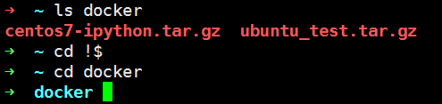


## ls的乐趣

ls命令应该是最常用的命令，除非你像黄蓉，有过目不忘的本领，惹得黄药师抱憾终身。

通过ls命令，我们可以查看目录的内容，确定各种重要文件和目录的属性。

ls命令的使用方法为

```
ls [path]
```

如果不加任何参数，默认列出当前目录的内容。

### ls /boot

列出/boot目录下的内容

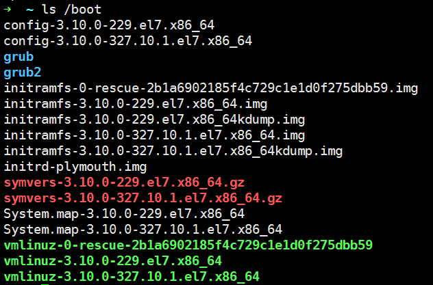

### 使用-l显示更多细节

-l 就是使用`long listing format`长格式，来显示更多的内容信息。

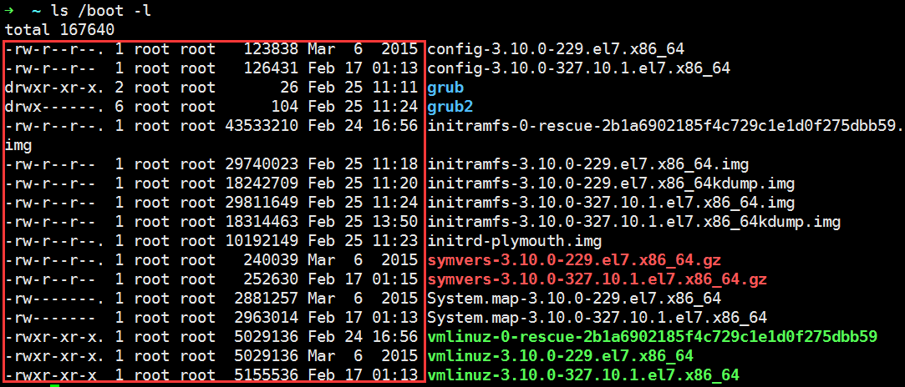

### 使用-t按照时间排序

如果希望看到最近创建的文件，就需要用到-t参数了。

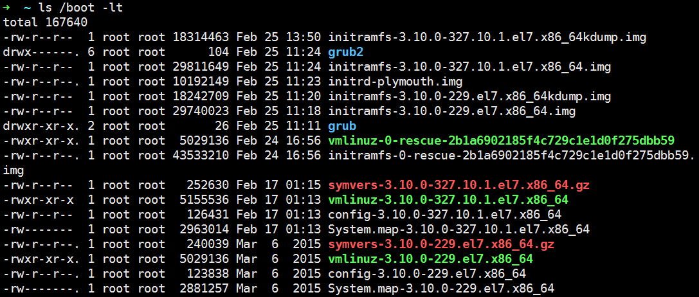

### 使用-r按照时间逆序

如果希望删除很早以前的文件，看到最早创建的文件，就需要用到-r参数了。


## chmod

Linux/Unix 的档案存取权限分为三级 : 档案拥有者、群组、其他。利用 chmod 可以控制档案如何被他人所存取。

mode : 权限设定字串，格式如下 : [ugoa...][[+-=][rwxX]...][,...]

其中u 表示该档案的拥有者，g 表示与该档案的拥有者属于同一个群体(group)者，o 表示其他以外的人，a 表示这三者皆是。

`+` 表示增加权限、– 表示取消权限、= 表示唯一设定权限。

r 表示可读取，w 表示可写入，x 表示可执行，X 表示只有当该档案是个子目录或者该档案已经被设定过为可执行。

-c : 若该档案权限确实已经更改，才显示其更改动作

-f : 若该档案权限无法被更改也不要显示错误讯息

-v : 显示权限变更的详细资料

-R : 对目前目录下的所有档案与子目录进行相同的权限变更(即以递回的方式逐个变更)

```
若用chmod 4755 filename可使此程式具有root的权限
```

## find命令

find命令是一个在UNIX文件系统中查找文件的常用命令，可以进行很多条件查找。

find的语法: `find 路径 约束条件`

如何查找在文件名中含有指定关键字的文件呢？

下面这条命令查找在"/etc"目录下所有文件名中含有"mail"的find /etc -name "_mail_"找在最近几天没有被修改过的文件？

下面这条命令会列出在当前目录下在最近60天没有被修改过文件

`find . -mtime +60`

如何查找在最近几天被修改的文件？

下面这条命令会列出在当前目录下在最近2天被修改过文件

```
find . –mtime -2
```

## 在less浏览时编辑文件

要编辑一个正在用less浏览的文件，可以按下v。你就可以用变量$EDITOR所指定的编辑器来编辑了：

less *.c

less foo.html

按下v键来编辑文件,退出编辑器后，你可以继续用less浏览了

## Linux下PS1、PS2的含义

1、PS1--默认提示符

可以通过修改Linux下的默认提示符，使其更加实用。

2、PS2--再谈提示符

一个非常长的命令可以通过在末尾加"\"使其分行显示。多行命令的默认提示符是">"。 我们可以通过修改PS2 ，将提示符修改为"continue->"

## Linux命令相关

### 什么是命令

linux命令是对Linux系统进行管理的命令。对于Linux系统来说，无论是中央处理器、内存、磁盘驱动器、键盘、鼠标，还是用户等都是文件，Linux系统管理的命令是它正常运行的核心，与之前的DOS命令类似。linux命令在系统中有两种类型：内置Shell命令和Linux命令。 也或者是用C、C++语言编写的程序，也可以是perl、python、ruby等脚本语言写的程序。

### 获得shell内置命令的帮助文档–help

可以使用**help cmd**来查看，有些需要使用**cmd –help**来查看。

### 显示命令的手册页 – man

man 命令提供有关主题的参考信息，例如命令、子例程和文件。man 命令提供由名称指定的对命令的单行描述。man 命令也提供所有命令的信息，这些命令的描述包含用户指定的关键字集合。

man 命令格式化指定的手册页面集合。如果为 Section 参数指定一个段，那么 man 命令在手册页面的该段中搜索 Title 参数指定的标题。Section 参数的值可以是 1 到 8 的阿拉伯数字或字母。

Section 数字是：

1 表示用户命令和守护进程。 2 表示系统调用和内核服务。 3 表示子例程。 4 表示特殊文件、设备驱动程序和硬件。 5 表示配置文件。 6 表示游戏。 7 表示杂项命令。 8 表示管理命令和守护进程。

### 显示合适的命令 – apropos

用来通过关键字查找定位手册页的名字和描述，比如我们想用linux绘制图像，但是不知道什么命令可以使用apropos plot命令，得出的结果为： bno_plot (1) – generate interactive 3D plot of IO blocks and sizes gnuplot (1) – an interactive plotting program pbmtoplot (1) – convert a PBM image into a Unix 'plot' file

### 显示命令的简要概述 – whatis

**whatis** 命令等同于使用 man -f 命令。

比如whatis gnuplot，输出为：

gnuplot (1) – an interactive plotting program 、

### 显示程序的info条目 – info

GNU项目提供了info页面来代替手册文档，info页面可以通过info阅读器来显示，info页面使用超链接，与网页结构类似。

## mkdir

**mkdir** 命令用来创建指定的名称的目录，要求创建目录的用户在当前目录中具有_写权限_，并且指定的目录名不能是当前目录中已有的目录。

### 命令格式：

```
mkdir [可选项] 目录
```

### 命令功能：

- 通过`mkdir`命令在指定位置创建以文件夹或目录
- 要创建文件夹或目录的用户必须对所创建的文件夹的父文件夹具有写权限
- 所创建的文件夹(目录)不能与其父目录(即父文件夹)中的文件名重名，即同一个目录下不能有同名的(区分大小写)。

### 命令参数：

```
-m, --mode=模式，设定权限<模式> (类似 chmod)，而不是 rwxrwxrwx 减 umask
**-p**, --parents  可以是一个路径名称。此时若路径中的某些目录尚不存在,加上此选项后,系统将自动建立好那些尚不存在的目录,即**一次可以建立多个目录**
-v, --verbose  每次创建新目录都显示信息
--help   显示此帮助信息并退出
--version  输出版本信息并退出
```

### 命令实例：

实例1：创建一个空目录

```
mkdir hello
```

实例2：递归创建多个目录

```
mkdir -p a/b/c/d/e/f/g
```

实例3：创建权限为777的目录

```
mkdir -m 777 test3
```

实例4：创建新目录都显示信息

```

mkdir -v test4
```

实例五：一个命令创建项目的目录结构

```
mkdir -vp project/{src/,include/,lib/,bin/,doc/{info,product},logs/{info,product},service/deploy/{info,product}}
```

```
$ mkdir -vp project/{src/,include/,lib/,bin/,doc/{info,product},logs/{info,product},service/deploy/{info,product}}

mkdir: created directory ‘project’
mkdir: created directory ‘project/src/’
mkdir: created directory ‘project/include/’
mkdir: created directory ‘project/lib/’
mkdir: created directory ‘project/bin/’
mkdir: created directory ‘project/doc’
mkdir: created directory ‘project/doc/info’
mkdir: created directory ‘project/doc/product’
mkdir: created directory ‘project/logs’
mkdir: created directory ‘project/logs/info’
mkdir: created directory ‘project/logs/product’
mkdir: created directory ‘project/service’
mkdir: created directory ‘project/service/deploy’
mkdir: created directory ‘project/service/deploy/info’
mkdir: created directory ‘project/service/deploy/product’


$ tree project/

project
├── bin
├── doc
│   ├── info
│   └── product
├── include
├── lib
├── logs
│   ├── info
│   └── product
├── service
│   └── deploy
│       ├── info
│       └── product
└── src

14 directories, 0 files
```

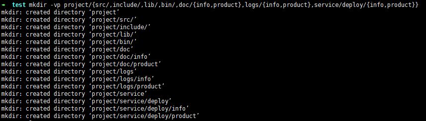

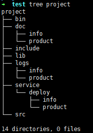

## 日期和时间

### date

显示时间信息。

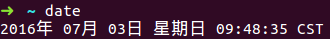

### cal

显示日历信息。

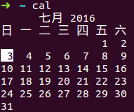

## useradd

**功能说明**：建立用户帐号。

语法：useradd [-mMnr][-c <备注>][-d <登入目录>][-e <有效期限>][-f <缓冲天数>][-g <群组>][-G <群组>][-s

<shell>][-u <uid>][用户帐号] 或 useradd -D [-b][-e &lt;有效期限&gt;][-f &lt;缓冲天数&gt;][-g &lt;群组&gt;][-G &lt;群组&gt;][-s <shell>]</shell></uid></shell>

参数       | 说明
-------- | ----------------------------
-c<备注>   | 加上备注文字。备注文字会保存在passwd的备注栏位中。
-d<登入目录> | 指定用户登入时的启始目录。
-D       | _变更预设值．
-e<有效期限> | 指定帐号的有效期限。
-f<缓冲天数> | 指定在密码过期后多少天即关闭该帐号。
-g<群组>   | 指定用户所属的群组。
-G<群组>   | 指定用户所属的附加群组。
-m       | 自动建立用户的登入目录。
-M       | 不要自动建立用户的登入目录。
-n       | 取消建立以用户名称为名的群组．
-r       | 建立系统帐号。

-s

<shell>
</shell>

| 指定用户登入后所使用的shell。 -u

<uid>
</uid>

| 指定用户ID。

## 远程登录不需要密码

1. 在本机上操作ssh-keygen
2. ssh-copy-id -i .ssh/id_rsa.pub remote_username@remote_ipaddress
3. ssh remote_username@remote_ipaddress

### 背景

最近参加了一个培训，分配了很多的账号，随便找个账号的密码，如下所示`gyDYKdf39dk*dfs@&`，关键操作的过程中，你还需要打开多个终端。

那么问题来了，如何才能缩短这个浪费生命的无聊过程呢，方法很简单，只有3步。

### 远程登录不需要密码

1 在本机上操作**ssh-keygen**，会在目录.ssh种生成一个id_rsa.pub文件 2 **ssh-copy-id -i .ssh/id_rsa.pub remote_username@remote_ipaddress** 3 **ssh remote_username@remote_ipaddress**

比如，来个实际操作：

> 打开一个终端 $ ssh-keygen 拷贝 $ ssh-copy-id -i .ssh/id_rsa.pub hero@192.168.2.3 愉快登录 $ ssh hero@192.168.2.3

此时即可无密码登陆remote了

在.ssh/config中输入下述信息，即可快捷将ssh remote_username@remote_ipaddress精简为ssh remote了

```
Host   remote
    HostName 192.168.254.123
    Port    22
    User    hero
    IdentityFile    ~/.ssh/id_rsa
```

## df - 查看硬盘大小

使用man来查看df，我们知道这个命令的含义为report file system disk space usage。 也就是查看文件系统的磁盘空间占用情况，可以利用该命令来获取硬盘被占用了多少空间，目前还剩下多少空间等信息。


df命令还是有一些参数的，比如：

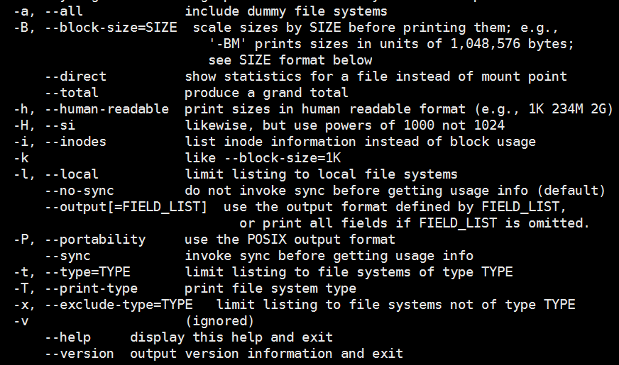

那么其中几个最常用的也就下面几个：

实例1：

```
df
```

不加任何参数，这个可读性不是很好，如下：

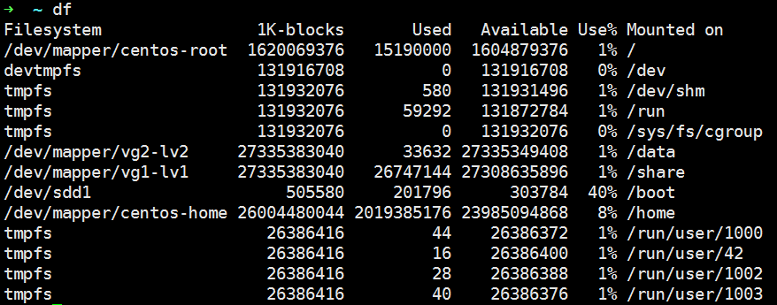

**实例2**：

```
df -h
```

这个是我用的很多的参数，-h的含义前面也可以看到是human-read的意思，方便我们人类，会使用M、G这样的单位来区别

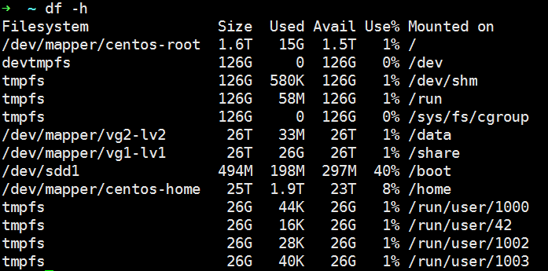

实例3：

```
df -lh
```

这个主要用于挂载了诸如NFS的系统，其中l的意思是local，也就是本地的文件系统，如果没有挂载其他文件系统，加不加l参数其实是一样的。

实例4：

```
df -T
```

用于打印文件系统类型，如下系统为xfs的。

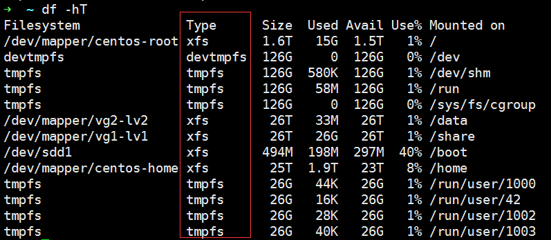

## free -查看系统内存

**free**这个命令在Linux系统监控的工具里面，算是使用的比较多的一个。

使用_man_查看可知，含义为：

> Display amount of free and used memory in the system

也就是显示可用、易用的系统内存，它直接读取`/proc/meminfo`文件。

**实例一**

先看下不加任何参数的时候，free的效果：

```bash
free
```


但是我比较喜欢用的还是_-h_参数，跟上一个命令df一样，此处的h表示_human being_的含义方便人类阅读。 除了这个还有_-b,-k,-m,-g_，含义分别为按照_字节、KB、MB、GB_的格式来显示。

```bash
free -h
```


```
               total        used        free      shared  buff/cache   available
Mem:           251G        6.1G        134G         69M        111G        244G
Swap:          4.0G          0B        4.0G
```

说下其中的含义:

- total : 表示总的物理内存大小，比如上面的就表示251GB的内存
- used ：表示已经使用的内存大小，比如上面的就是使用了6.1GB
- free ：表示可用多少
- shared：表示多个进程共享的内存大小
- buff/cache：表示磁盘缓存的大小，这里有两个方面，`buff`和`cache`，两个的含义不同

  - buff ：something that has yet to be 'writeen' to disk ,还没有写入磁盘
  - cache: something that had been 'read' from the disk and store for later user，从磁盘读取的方便下一次使用
  - 这里就设计到Linux的设计哲学，比如读取一个100G的文件，第一次所使用的时间总归是后面再次读取的时间的好几倍，当然前提是没有释放掉caches

- available：当然含义为可用的内存容量大小

**实例二**

还有一个比较常用的就是，如果你希望过一段时间就看下free的情况，OK，使用参数`-s`，后面跟的单位是秒，也就是每个几秒，统计一下使用的内存情况，比如我们每个2s，显示一下

```
free -s 2
```


## file鉴别大神

### 命令简介

file的官方解释为：

> file - determine file type

也就是说可以识别文件类型的意思，也可用来辨别一些文件的编码格式。它是通过查看文件的头部信息来获取文件类型，而不是像Windows通过扩展名来确定文件类型的，说起Windows吗，*啥也不说了*。

### 实例

下面看几个比较使用的例子。

### 实例一 ：默认

```
file file_name
```

file后直接跟文件，得到如下所示信息

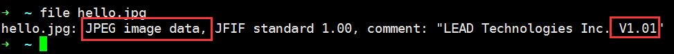

### 实例二：不显示名称

```
file -b file_name
```

加上-b参数，是`brief`的含义，将只显示文件辨识结果，不显示文件名称了，这个其实对于很多文件而言，不是很友好，注意下图红线的区别。

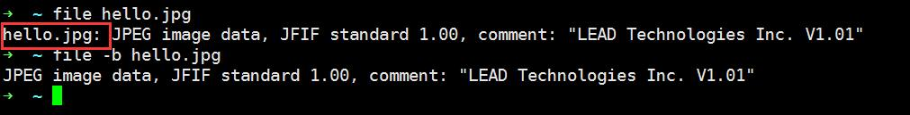

### 实例三：输出易懂信息

```
file -i file_name
```

加上-i参数，是`mime`类型的含义，*我也不懂是啥意思，但是我能刚方便地读懂我想知道的文件类型的含义*。这就够了，不是吗，毕竟我们是来是用`file`命令的。

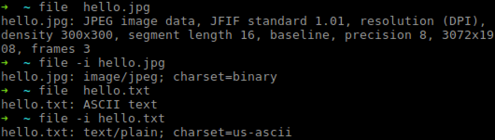

### 实例四：查看文件中的文件名的文件信息

```
file -f file_name
```

**这个咋听着这么拗口**，`其实很简单，其实并不难`，加上-f参数，是`file-from`类型的含义，到底是几个意思呢，也就是你想查看文件的类型信息的文件名在一个文件里面，从这个文件里面读取文件来的到信息，如下即可晓得。


### 实例五：好看的鸡肋

```
file -F “ === ” file_name
```

这个功能说实话，没搞明白有什么作用，默认的`:`感觉挺好用的，当然这个应该属于定制型的，如下所示：

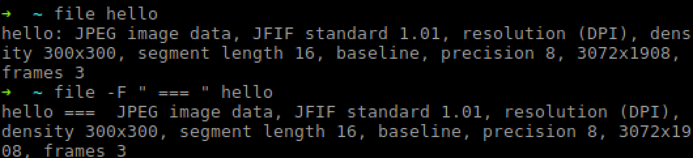

### 实例六：查看软链接的文件信息

```
file -L file_name
```

默认情况下，如果没有`L`参数，只能得到这个文件是软链接的信息，如果加上这个参数，就能看到源文件的文件信息，这个功能还是很赞的。

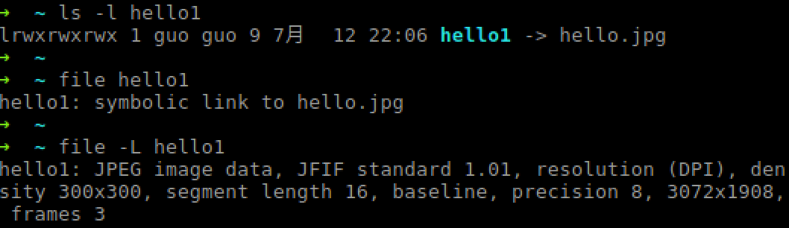


# OS

## Ubuntu

## CentOS

# 更多信息

Hi，XDJM们，更多信息欢迎移步[我的github](https://github.com/shaoguangleo)、[CSDN](http://blog.csdn.net/shaoguangleo)或微信公众号letsProgramming.


